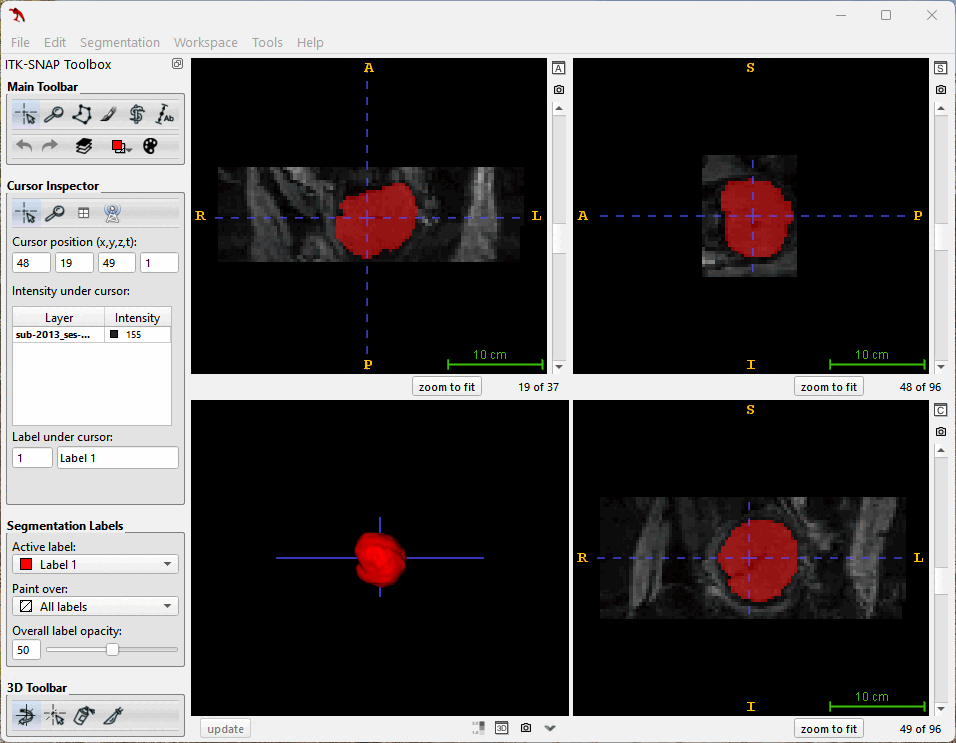
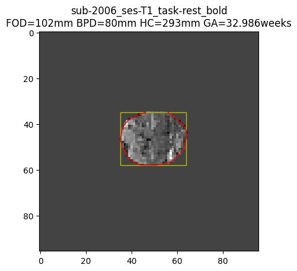

# Fetal_Brain_GA_Prediction

This program allows users to upload multiple fMRI images at once and predict gestational age based on head circumference.

The predicted value is calculated using an empirical formula, which can be customized by the user.

The program code and predicted values are for research and academic purposes only. **They should not be used for commercial applications.**

## Methods

### Fetal Brain Segmentation: 

We employed the high-performance VNet model, previously demonstrated to excel in [fetal resting-state functional MRI brain segmentation](https://arxiv.org/abs/2311.10844), to precisely extract fetal brain images from fMRI data.

### Head Circumference Measurement: 

OpenCV functions were meticulously applied to process the generated mask images, enabling accurate determination of both the minimum circumscribed rectangle and circumference of the fetal brain.

### Automation and Error Reduction: 

The algorithm automatically measures BPD/FOD and HC across multiple 3D fMRI images, selecting the median value for enhanced precision and substantial time savings compared to manual segmentation.

|| FileName | pixdim	| Slice	| FOD	| BPD	| HC  | GA  |
| --- | ---      | ---    | ---   | --- | --- | --- | --- |
| 0 |	sub-2006_ses-T1_task-rest_bold	| 3.5	| 17	| 98.0	| 91.0	| 304.7	| 34.497446 |
| 1	| sub-2006_ses-T1_task-rest_bold	| 3.5	| 17	| 101.5	| 80.5	| 293.1	| 32.985815 |
| 2	| sub-2006_ses-T1_task-rest_bold	| 3.5	| 17	| 98.0	| 80.5	| 290.9	| 32.704743 |
| 3	| sub-2006_ses-T1_task-rest_bold	| 3.5	| 17	| 98.0	| 80.5	| 292.6	| 32.921778 |
| 4	| sub-2006_ses-T1_task-rest_bold	| 3.5	| 16	| 98.0	| 80.5	| 291.1	| 32.730221 |
| 5	| sub-2006_ses-T1_task-rest_bold	| 3.5	| 16	| 100.1	| 84.5	| 296.5	| 33.423721 |
| 6	| sub-2006_ses-T1_task-rest_bold	| 3.5	| 17	| 94.0	| 89.1	| 293.8	| 33.075622 |

## Advantages

  * **Efficiency:** Automating BPD/FOD and HC measurements eliminates time-consuming manual segmentation.

  * **Accuracy:** Direct HC measurement using image processing circumvents potential errors introduced by estimations based on BPD and FOD.

  * **Robustness:** Median value selection across multiple 3D images mitigates measurement errors.

## Conclusion

  * **Strong Correlation with Manual Measurements:** The AI model's accuracy, particularly in HC predictions, is validated by its strong correlations with manual measurements.
  * **AI as a Valuable Tool in Prenatal Care:** This opensource code the merits of integrating AI into prenatal care, empowering clinicians to customize and modify the formula for predicting GA using HC, which could further improve the accuracy of the prediction and ultimately lead to better outcomes for patients.

## Data
The fMRI data used in this demonstration were obtained from the [OpenNeuro dataset](https://openneuro.org/datasets/ds003090/versions/1.0.0)

**Citation:** Automated Brain Masking of Fetal Functional MRI Saige Rutherford, Pascal Sturmfels, Mike Angstadt, Jasmine Hect, Jenna Wiens, Marion van den Heuval, Dustin Scheinost, Moriah Thomason, Chandra Sripada bioRxiv 525386; doi: https://doi.org/10.1101/525386

**We encourage you to test the program with your own dataset. If you have any questions or feedback, please feel free to open an issue or leave a comment.**
